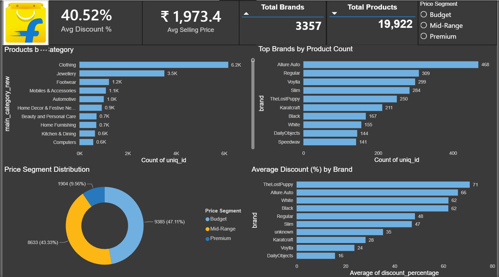
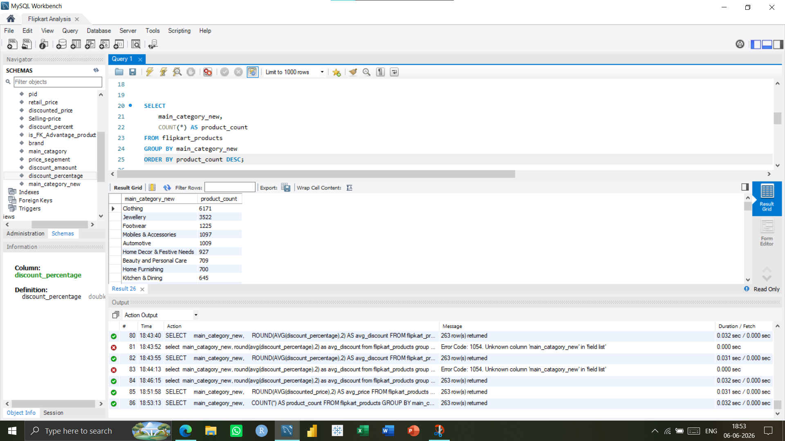
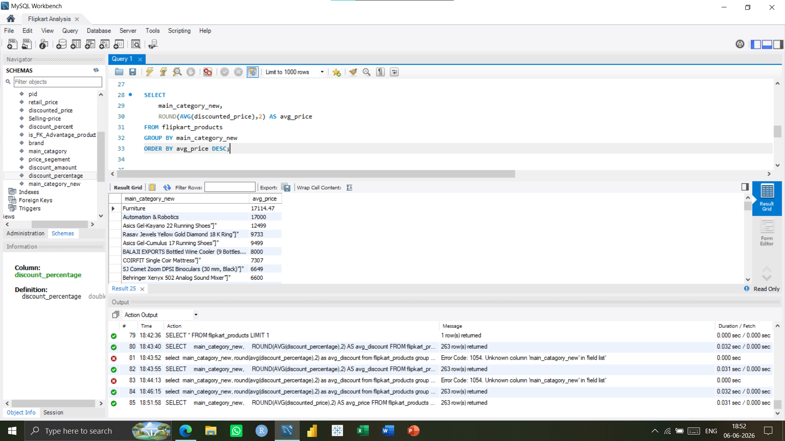
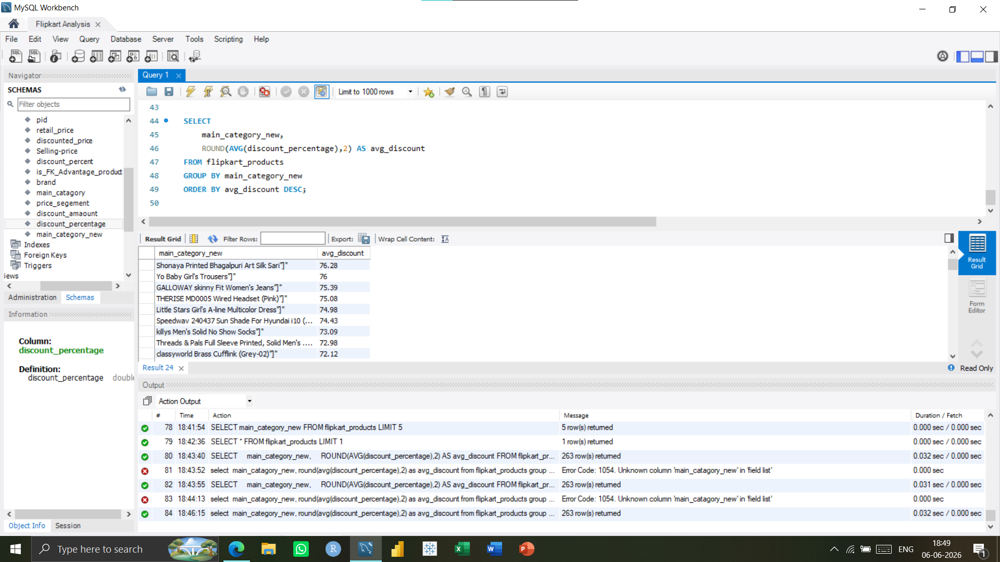

# 🛒 Flipkart Sales Analysis using Python, SQL & Power BI

An end-to-end data analytics project focused on analyzing Flipkart product data using **Python**, **SQL**, and **Power BI**. The project demonstrates the complete analytics workflow—from data cleaning and exploratory data analysis to SQL-based business insights and an interactive Power BI dashboard.

---

## 📌 Project Workflow

Raw Dataset  
⬇️  
Data Cleaning & Preprocessing (Python)  
⬇️  
Exploratory Data Analysis (Python)  
⬇️  
Business Queries (SQL)  
⬇️  
Interactive Dashboard (Power BI)

---

## 🛠️ Tech Stack

- 🐍 Python
- 🗄️ SQL
- 📊 Power BI
- 📑 Pandas
- 📈 NumPy
- 📉 Matplotlib
- 📋 Jupyter Notebook
- 🌐 Git & GitHub

- ---

## 📂 Repository Structure

```text
Flipkart-Sales-Analysis-Python-PowerBI/
│
├── Dashboard
│   └── flipkart_sales_dashboard.png
│
├── Power BI
│   └── power bi.pbix
│
├── Python
│   └── Flipkart_Data_Cleaning_and_EDA.ipynb
│
├── SQL
│   ├── Flipkart_SQL_Analysis.sql
│   ├── 01_Category_Product_Count.png
│   ├── 02_Average_Price_By_Category.png
│   └── 03_Average_Discount_By_Category.png
│
└── README.md
```
---

## 📂 Dataset

This project uses a publicly available **Flipkart Product Dataset**.

🔗 **Dataset Source:** [YOUR_KAGGLE_DATASET_LINK](https://www.kaggle.com/datasets/PromptCloudHQ/flipkart-products)

The original dataset is publicly available on Kaggle and is therefore not included in this repository. This keeps the repository lightweight while allowing anyone to download the original data directly from the source.

The Python notebook included in this repository contains the complete data cleaning and preprocessing workflow.
---

## 📊 Dashboard Preview

### Flipkart Sales Dashboard



---

## 🎯 Business Objectives

The primary objectives of this project were to:

- Analyze Flipkart product data to identify pricing and discount trends.
- Perform data cleaning and preprocessing using Python.
- Execute SQL queries to answer key business questions.
- Develop an interactive Power BI dashboard for data visualization.
- Generate actionable business insights to support data-driven decision-making.

- ---

## 🐍 Python Data Preparation

Python was used for:

- Data Cleaning and Preprocessing
- Handling Missing Values
- Removing Duplicate Records
- Data Type Conversion
- Exploratory Data Analysis (EDA)
- Preparing the dataset for SQL analysis and Power BI visualization

The complete workflow is available in the **Python** folder.

---

## 🗄️ SQL Business Analysis

The following SQL queries were executed to analyze the dataset:

| Business Question | Status |
|-------------------|:------:|
| Category-wise Product Count | ✅ |
| Average Product Price by Category | ✅ |
| Average Discount Percentage by Category | ✅ |

### Query Results

#### 📦 Category-wise Product Count



---

#### 💰 Average Price by Category



---

#### 🏷️ Average Discount by Category



---

## 📈 Dashboard Highlights

The Power BI dashboard provides an interactive overview of Flipkart product data through key performance indicators and visualizations.

### Key Performance Indicators (KPIs)

- 🏷️ Total Brands
- 📦 Total Products
- 💰 Average Selling Price
- 🎯 Average Discount

### Dashboard Features

- Product category analysis
- Brand-wise product distribution
- Pricing trends
- Discount analysis
- Interactive filtering and drill-down capabilities

---

---

# 💡 Business Recommendations

Based on the dashboard insights, the following actions could help improve business performance.

## 📦 Grow Where the Catalog Already Wins

Clothing and Jewellery dominate the product catalog. Increasing assortment depth and marketing investment in these categories while reviewing underrepresented categories could unlock additional growth.

---

## 🏷️ De-Risk Brand Concentration

A few brands account for a significant share of product listings. Expanding partnerships with additional brands may reduce dependency and improve catalog diversity.

---

## 💎 Re-Examine the Premium Segment

Budget and Mid-Range products represent nearly 90% of the catalog. Exploring opportunities to expand the Premium segment could improve margins and attract higher-value customers.

---

## 💸 Audit High-Discount Brands

Brands with consistently high discounts should be reviewed to determine whether discounts are part of a long-term pricing strategy or indicate pricing inefficiencies.

---

## 💡 Key Business Insights

- Identified product categories with the highest product availability.
- Compared average selling prices across different product categories.
- Analyzed average discount percentages to identify promotional trends.
- Built an interactive dashboard for quick business decision-making.
- Demonstrated how Python, SQL, and Power BI can be integrated into a complete analytics workflow.

- ---

## 👨‍💻 Author

**Amir Jamal**

MBA (Business Analytics)

G.L. Bajaj Institute of Technology & Management

- 🌐 GitHub: https://github.com/Amir-Jamal
- 💼 LinkedIn: www.linkedin.com/in/amir-jamal-
